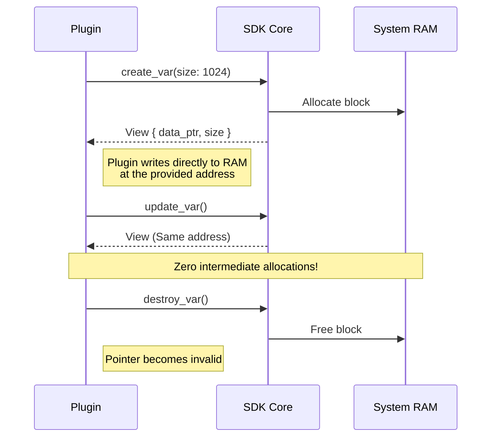
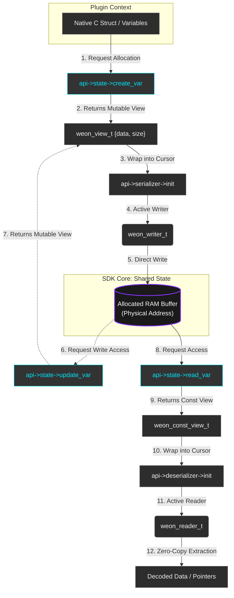
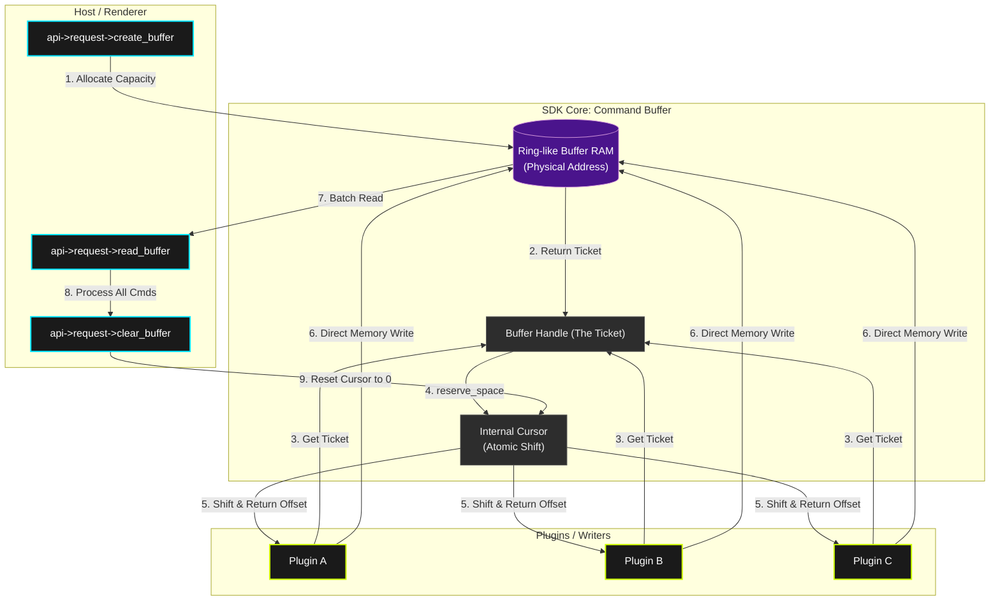

<div align="center">

# WeOn SDK
**The High-Performance Core for Next-Gen Plugin Systems**


[](https://github.com/btcorporated-a11y/weon-sdk/actions/workflows/pipeline.yml)

---
</div>

<table border="0">
  <tr>
    <td width="75%" valign="top">
      <h3>System Overview</h3>
      <p>
        <b>WeOn SDK</b> is a high-performance core designed for developing modular plugin systems with a focus on ultra-low latency and ABI stability. Written in <b>Zig</b>, it provides C/C++, and Rust developers with a powerful interface for direct memory interaction, leveraging <b>Zero-Copy</b> principles to eliminate data transfer overhead.
      </p>
      <p>
        <i>Current Status: <b>v2.0.0-alpha</b> — Ready for early-stage integration and performance profiling.</i>
      </p>
    </td>
    <td width="25%" align="center" valign="middle">
      
    </td>
  </tr>
</table>

---
<details>
<summary>🏗️ <b>Architecture & Core Principles</b> (Click to expand)</summary>

### True Zero-Copy
Unlike traditional SDKs that copy data between various buffers, WeOn provides plugins with direct access to the core's system memory.


### Memory Ownership Management
The Core acts as an arbiter: it allocates physical RAM blocks and provides plugins with **Fat Pointers** via `View` structures.


</details>

---

<details>
<summary>🛠️ <b>Core Modules</b> (Click to expand)</summary>

### 1. Shared State (Variable Manager)
Enables plugins to create variables in a global namespace accessible to other modules for reading. Security is maintained via `owner_id` validation: only the creator can modify or delete their specific data.



### 2. Data Bus (Shared Request)
A high-speed command bus designed for streaming command buffers. It implements a **Multi-Writer / Single-Reader** architecture.

* **Reserve Space**: Plugins request space for a single command; the core atomically shifts an internal cursor.
* **Batch Read**: The Host (e.g., a Renderer) consumes all accumulated commands in a single efficient call.


</details>

---

<details>
<summary>📦 <b>Project Structure</b> (Click to expand)</summary>

```text
.
├── bin/                 # Build artifacts (headers, .so, .dll, .lib)
├── code/                # Core engine source code (Zig)
│   ├── include/weon/    # Public C Headers
│   └── src/             # Implementation logic
├── scripts/             # Build and installation scripts (Linux/Windows)
└── tests/               # Integration test suite (C)
```
</details>

---

<details>
<summary>🚀 <b>Quick Start</b> (Click to expand)</summary>

### Prerequisites
* **Zig Compiler** (v0.13.0 or higher).
* **GCC/Clang** (for running tests).

### Build & Install (Linux)
```bash
chmod +x build.sh
./build.sh
```
The script will automatically:
1. Clean previous build artifacts.
2. Compile the SDK for both Linux and Windows (cross-compilation).
3. Execute integration tests to verify data integrity.
4. Install the SDK to system paths (e.g., `/usr/local/lib/weon`).

### C Usage Example
```c
#include <weon/api.h>

int main() {
    if (weon_sdk_init()) { 
        const weon_api_t* api = weon_sdk_get_api(); 
        api->log->print(WEON_LOG_INFO, "APP", "WeOn SDK Ready!"); 
    }
    return 0;
}
```
</details>

---

## 📄 License
This project is released under the **MIT License**. See the [LICENSE] file for full details.