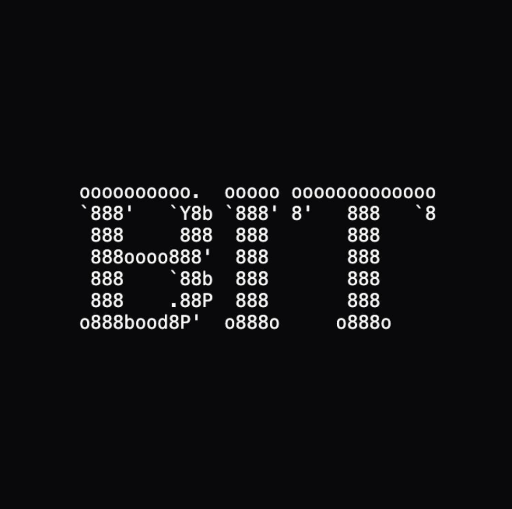

<p align="right">
  
</p>

# WeOn SDK v2.0.0
[](https://github.com/your-repo)
[](LICENSE)
[]()

A high-performance, cross-platform SDK core written in **Zig**, designed for low-latency plugin systems. It provides a robust ABI-stable bridge between the core engine and external plugins (C/C++, Rust, etc.).

### 🧩 Core Architecture
The WeOn SDK acts as a high-speed bridge between the **Zig-powered Core** and external plugins. It focuses on zero-copy principles and predictable memory layouts.


| Module | Responsibility | Key Components |
| :--- | :--- | :--- |
| **Memory** | Centralized allocation | `Shared State`, `Safe Tracking` |
| **Data Bus** | Multi-threaded IO | `Shared Request`, `Command Buffer` |
| **Tools** | Data transformation | `Serializer`, `FNV-1a Hash` |

---

## Key Features

* **Memory Management**: Centralized Shared State manager with safe allocation tracking.
* **Data Bus**: High-speed Command Buffer (Shared Request) for multi-threaded communication.
* **Binary Serialization**: Built-in efficient Serializer/Deserializer with length-prefix support.
* **Cross-Platform**: First-class support for Linux (GNU ABI) and Windows (MSVC ABI).
* **Tooling**: Integrated logging and FNV-1a hashing tools.

## Project Structure

<details>
<summary><b>Click to expand directory tree</b></summary>

```text
.
├── bin/                # Compiled artifacts (SO/DLL/Headers)
├── code/               # Zig source & internal logic
│   ├── src/ffi/        # ABI definitions
│   └── include/        # Public C Headers
├── tests/              # Integration & Validation suite
└── assets/             # Branding & Resources
```
</details>

## 🛠 Building the SDK

The SDK uses a custom build system to ensure ABI compatibility.

### Requirements
* **Zig Compiler** (v0.15.2 or higher)
* **GCC/Clang** (For running integration tests on Linux)

### Compilation
To build for all supported platforms and run automated validation tests:

```bash
chmod +x build.sh
./build.sh
```

The output will be located in the `bin/` directory, including shared libraries and public C headers.

## 💻 Quick Start (C API)

To integrate the SDK into your project, include the main entry point:

```c
#include "weon/api.h"

// Initialize SDK and get the Core API
if (weon_sdk_init()) {
    const struct weon_api_t* api = weon_sdk_get_api();
    api->log->print(WEON_LOG_LEVEL_INFO, "APP", "WeOn SDK is ready!");
}
```

Compile your application by linking against `libweon-sdk.so` (Linux) or `weon-sdk.dll` (Windows) and adding `bin/include` to your include paths.
