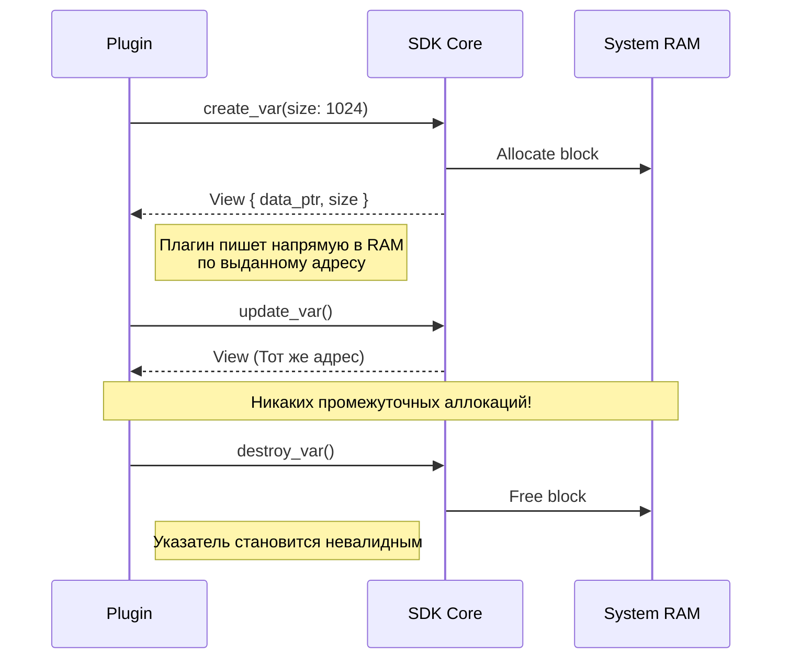
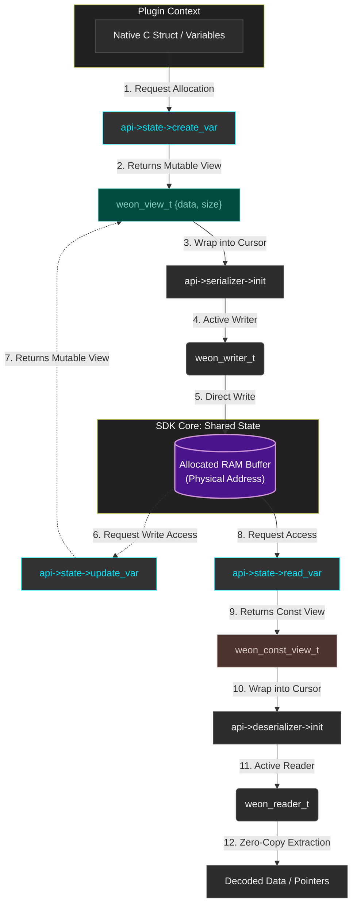
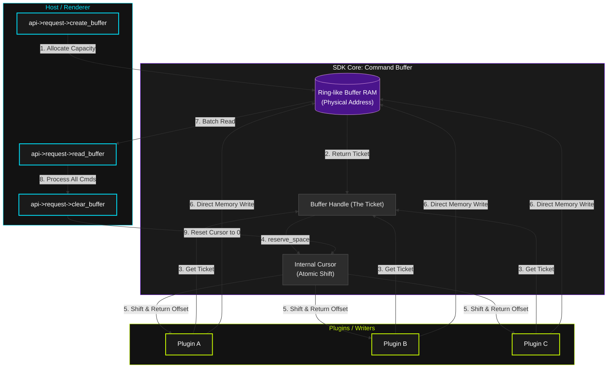

<p align="right">
  
</p>

# WeOn SDK v2.0.0-alpha

[cite_start]**WeOn SDK** — это высокопроизводительное ядро для разработки плагинных систем с упором на минимальные задержки и стабильность ABI[cite: 10]. [cite_start]Написанное на языке **Zig**, оно предоставляет разработчикам на C/C++ и Rust интерфейс для прямого взаимодействия с памятью без лишних затрат на копирование данных (Zero-Copy)[cite: 10, 11].

---

## 🏗️ Архитектура и принципы работы

### Истинный Zero-Copy
[cite_start]В отличие от традиционных SDK, которые копируют данные между буферами, WeOn предоставляет плагинам прямой доступ к системной памяти ядра[cite: 7].

```mermaid
graph TD
    subgraph Standard_Approach [Обычный SDK Медленно]
        A[Plugin A] -- "Copy Data" --> B[Intermediate Buffer]
        B -- "Copy Data" --> C[Core]
        C -- "Copy Data" --> D[Plugin B]
        style Standard_Approach fill:#2D572C,stroke:#ff0000
    end

    subgraph WeOn_Approach [WeOn SDK Zero-Copy]
        CoreMemory[(Global Shared Memory)]
        PA[Plugin A] -- "Direct Access (View)" --> CoreMemory
        PB[Plugin B] -- "Direct Access (ConstView)" --> CoreMemory
        style WeOn_Approach fill: #252850,stroke:#00aa00
    end
```



### Управление владением памятью
[cite_start]Ядро выступает в роли арбитра: оно выделяет физические блоки RAM и передает плагинам "толстые указатели" (Fat Pointers) в виде структур `View`[cite: 6, 7].



---

## 🛠️ Основные модули

### 1. Shared State (Менеджер состояний)
[cite_start]Позволяет плагинам создавать переменные в общем пространстве имен, доступные другим модулям для чтения[cite: 7]. [cite_start]Безопасность обеспечивается проверкой `owner_id`: только создатель может изменять или удалять свои данные[cite: 16].



### 2. Data Bus (Shared Request)
[cite_start]Высокоскоростная шина для передачи потоков команд[cite: 8]. [cite_start]Реализует архитектуру "Много писателей — Один читатель"[cite: 8].

* [cite_start]**Reserve Space**: Плагины запрашивают место под одну команду, ядро атомарно сдвигает внутренний курсор[cite: 8, 17].
* [cite_start]**Batch Read**: Хост (например, рендерер) считывает все накопленные команды за один вызов[cite: 8, 17].



---

## 📦 Структура проекта

```text
.
[cite_start]├── bin/                 # Готовые артефакты (headers, .so, .dll, .lib) [cite: 1]
[cite_start]├── code/                # Исходный код ядра на Zig [cite: 1, 11]
[cite_start]│   ├── include/weon/    # Публичные C-заголовки [cite: 10]
[cite_start]│   └── src/             # Реализация логики [cite: 11]
├── scripts/             # Скрипты сборки и установки для Linux/Windows
[cite_start]└── tests/               # Набор интеграционных тестов на C [cite: 12]
```

---

## 🚀 Быстрый старт

### Требования
* **Zig Compiler** (v0.13.0 или выше).
* **GCC/Clang** (для запуска тестов).

### Сборка и установка (Linux)
```bash
chmod +x build.sh
./build.sh
```
Скрипт автоматически:
1. [cite_start]Очистит старые сборки[cite: 13].
2. [cite_start]Скомпилирует SDK под Linux и Windows[cite: 13].
3. [cite_start]Запустит интеграционные тесты для проверки целостности данных[cite: 13].
4. [cite_start]Установит SDK в системные пути (`/usr/local/lib/weon`)[cite: 13].

### Использование в C
```c
#include <weon/api.h>

int main() {
    [cite_start]if (weon_sdk_init()) { // [cite: 11]
        const weon_api_t* api = weon_sdk_get_api(); [cite_start]// [cite: 11]
        api->log->print(WEON_LOG_INFO, "APP", "WeOn SDK Ready!"); [cite_start]// [cite: 11, 14]
    }
    return 0;
}
```

---

## 📄 Лицензия
Проект распространяется под лицензией **MIT**. Подробности в файле [LICENSE].